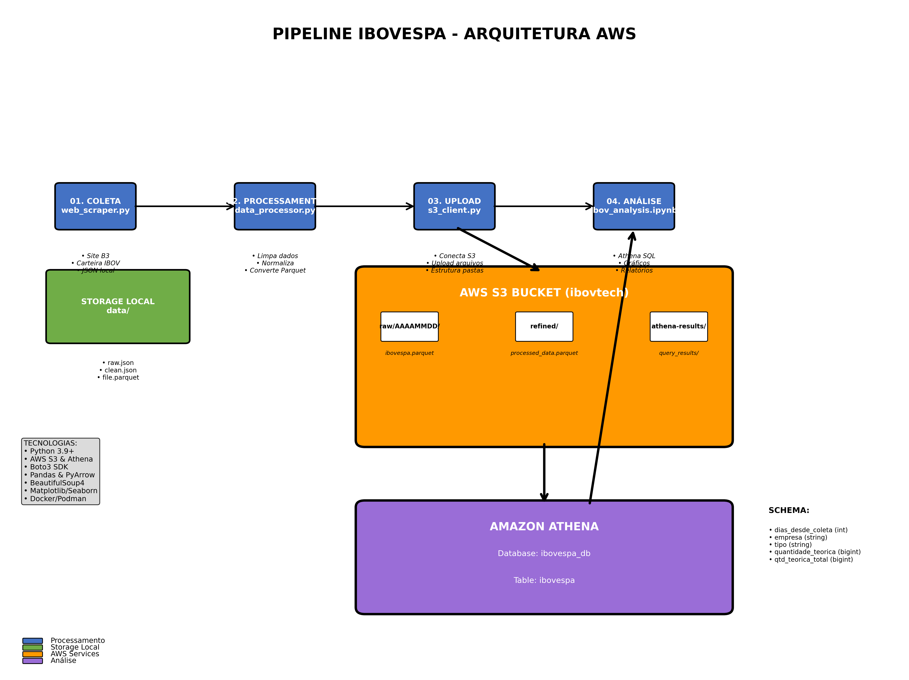

# Tech Challenge 02 - Pipeline de Dados IBOVESPA

Este projeto implementa um pipeline de dados para coleta, processamento e análise de dados do IBOVESPA, utilizando AWS S3 para armazenamento e Amazon Athena para análises.

## 🏗️ Arquitetura do Projeto

```
techchallenge_02/
├── src/
│   ├── 01_web_scraper.py      # Coleta de dados do site B3
│   ├── 02_data_processor.py   # Processamento e transformação dos dados
│   ├── 03_s3_client.py        # Upload para AWS S3
│   └── ibov_analysis.ipynb    # Notebook para análise no Athena
├── data/                      # Dados locais (temporário)
├── Containerfile                # Container da aplicação
├── requirements.txt           # Dependências Python
└── README.md                  # Documentação
```

## 🔄 Fluxo de Execução
```
┌─────────────────────────────────────────────────────────────────────────────┐
│                          PIPELINE IBOVESPA - AWS                            │
└─────────────────────────────────────────────────────────────────────────────┘

┌──────────────┐    ┌──────────────┐    ┌──────────────┐    ┌──────────────┐
│   COLETA     │    │ PROCESSAMENTO│    │   UPLOAD     │    │   ANÁLISE    │
│              │    │              │    │              │    │              │
│ 01_web_      │──▶│ 02_data_     │──▶│ 03_s3_       │──▶│ ibov_        │
│ scraper.py   │    │ processor.py │    │ client.py    │    │analysis.ipynb│
│              │    │              │    │              │    │              │
│ • Site B3    │    │ • Limpa dados│    │ • Conecta S3 │    │ • Athena SQL │
│ • Carteira   │    │ • Normaliza  │    │ • Upload     │    │ • Gráficos   │
│ • JSON local │    │ • Parquet    │    │ • Estrutura  │    │ • Relatórios │
└──────────────┘    └──────────────┘    └──────────────┘    └──────────────┘
        │                   │                   │                   │
        ▼                   ▼                   ▼                   ▼
┌──────────────┐    ┌──────────────┐    ┌─────────────────────────────────────┐
│ data/        │    │ data/        │    │           AWS S3 BUCKET             │
│ ├─raw.json   │    │ ├─clean.json │    │         (ibovtech)                  │
│              │    │ └─file.parquet│   │                                     │
└──────────────┘    └──────────────┘    │ ┌─────────────────────────────────┐ │
                                        │ │ raw/                            │ │
                                        │ │ └── AAAAMMDD/                   │ │
                                        │ │     └── ibovespa.parquet        │ │
                                        │ ├─────────────────────────────────┤ │
                                        │ │ refined/                        │ │
                                        │ │ └── processed_data.parquet      │ │
                                        │ ├─────────────────────────────────┤ │
                                        │ │ athena-results/                 │ │
                                        │ │ └── query_results/              │ │
                                        │ └─────────────────────────────────┘ │
                                        └─────────────────────────────────────┘
                                                          │
                                                          ▼
                                        ┌─────────────────────────────────────┐
                                        │         AMAZON ATHENA               │
                                        │                                     │
                                        │ • Queries SQL                       │
                                        │ • Análise de dados                  │
                                        │ • Tabela: ibovespa_db.ibovespa      │
                                        │                                     │
                                        │ Schema:                             │
                                        │ - dias_desde_coleta (int)           │
                                        │ - empresa (string)                  │
                                        │ - tipo (string)                     │
                                        │ - quantidade_teorica (bigint)       │
                                        │ - qtd_teorica_total (bigint)        │
                                        └─────────────────────────────────────┘
```                                    

## Representacão Visual do Pipeline



### 1. **Coleta de Dados** (`01_web_scraper.py`)
- Acessa o site da B3 (Brasil, Bolsa, Balcão)
- Extrai dados da carteira teórica do IBOVESPA
- Salva dados brutos em formato JSON local
- **Dados coletados:**
  - Código da empresa
  - Tipo de ação (ON, PN, etc.)
  - Quantidade teórica
  - Participação percentual

### 2. **Processamento de Dados** (`02_data_processor.py`)
- Carrega dados JSON coletados
- Limpa e normaliza os dados
- Adiciona campos calculados (dias desde coleta, totais)
- Converte para formato Parquet otimizado
- **Transformações aplicadas:**
  - Padronização de nomes de colunas
  - Conversão de tipos de dados
  - Cálculo de métricas agregadas
  - Validação de dados

### 3. **Upload para S3** (`03_s3_client.py`)
- Conecta ao AWS S3 usando boto3
- Cria estrutura de pastas hierárquica
- Faz upload dos arquivos Parquet processados
- **Estrutura no S3:**
  ```
  s3://ibovtech/
  ├── raw/
  │   └── AAAAMMDD/           # Data da coleta
  │       └── ibovespa.parquet # Apenas 1 arquivo por data
  ├── refined/                 # Dados processados para análise
  └── athena-results/         # Resultados das queries Athena
  ```

### 4. **Análise de Dados** (`ibov_analysis.ipynb`)
- Conecta ao Amazon Athena
- Executa queries SQL nos dados do S3
- Gera visualizações e relatórios
- **Análises disponíveis:**
  - Top 10 ações por quantidade teórica
  - Distribuição por tipo de ação
  - Evolução temporal das posições

## 🚀 Como Executar

### Configuração de Ambiente

1. **Clone o repositório:**
```bash
git clone <repository-url>
cd techchallenge_02
```

2. **Configure as variáveis de ambiente:**
```bash
export AWS_ACCESS_KEY_ID="sua-access-key"
export AWS_SECRET_ACCESS_KEY="sua-secret-key"
export AWS_DEFAULT_REGION="us-east-1"
export AWS_BUCKET_NAME="ibovtech"
export TZ="America/Sao_Paulo"
```

### Execução Local

1. **Instale as dependências:**
```bash
pip install -r requirements.txt
```

2. **Execute o pipeline completo:**
```bash
# Passo 1: Coleta de dados
python src/01_web_scraper.py

# Passo 2: Processamento
python src/02_data_processor.py

# Passo 3: Upload para S3
python src/03_s3_client.py

# Passo 4: Análise (Jupyter Notebook)
jupyter notebook src/ibov_analysis.ipynb
```

### Execução com Docker/Podman

1. **Build da imagem:**
```bash
podman build -t techchallenge-app .
```

2. **Execução do container:**
```bash
podman run --name scraper-b3 \
  -d \
  -e AWS_ACCESS_KEY_ID= \
  -e AWS_SECRET_ACCESS_KEY= \
  -e TZ=America/Sao_Paulo \
  quay.io/parraes/techchallenge_02:v2
```


## 📊 Estrutura de Dados

### Schema da Tabela IBOVESPA

| Campo | Tipo | Descrição |
|-------|------|-----------|
| `dias_desde_coleta` | int | Dias desde a última coleta |
| `empresa` | string | Código da empresa |
| `tipo` | string | Tipo de ação (ON, PN, etc.) |
| `quantidade_teorica` | bigint | Quantidade teórica da ação |
| `qtd_teorica_total` | bigint | Quantidade teórica total |

### Localização dos Dados no S3

- **Dados brutos:** `s3://ibovtech/raw/YYYYMMDD/`
- **Dados refinados:** `s3://ibovtech/refined/`
- **Resultados Athena:** `s3://ibovtech/athena-results/`

## 🛠️ Tecnologias Utilizadas

- **Python 3.9+** - Linguagem principal
- **AWS S3** - Armazenamento de dados
- **Amazon Athena** - Engine de consultas SQL
- **Boto3** - SDK AWS para Python
- **Pandas** - Manipulação de dados
- **PyArrow** - Processamento Parquet
- **BeautifulSoup4** - Web scraping
- **Matplotlib/Seaborn** - Visualizações
- **Docker/Podman** - Containerização

## 📈 Monitoramento e Logs

O projeto inclui logging detalhado em todos os scripts:

- **Nível INFO:** Operações normais e progresso
- **Nível ERROR:** Erros e exceções
- **Nível DEBUG:** Informações detalhadas de debug

Logs são enviados para stdout e podem ser coletados pelo sistema de logging do container.

## 🔧 Configurações Avançadas

### Personalização do Bucket S3
```python
AWS_BUCKET_NAME = os.getenv("AWS_BUCKET_NAME", "ibovtech")
```

### Configuração de Região
```python
AWS_DEFAULT_REGION = os.getenv("AWS_DEFAULT_REGION", "us-east-1")
```

### Estrutura de Pastas Customizada
O script `03_s3_client.py` permite personalizar a estrutura de pastas:
- Pasta raiz: `raw/`
- Subpastas por data: `AAAAMMDD/`
- Apenas 1 arquivo Parquet por data (substituição automática)

## 🔐 Segurança

- Credenciais AWS são carregadas via variáveis de ambiente
- Não há credenciais hardcoded no código
- Uso de IAM roles recomendado para produção
- Validação de permissões S3 antes de operações

## 📝 Próximos Passos

- [ ] Implementar agendamento automático (AWS Lambda/EventBridge)
- [ ] Adicionar mais validações de dados
- [ ] Implementar notificações de erro
- [ ] Adicionar métricas de performance
- [ ] Criar dashboard em tempo real

## 🤝 Contribuição

1. Fork o projeto
2. Crie uma branch para sua feature
3. Commit suas mudanças
4. Push para a branch
5. Abra um Pull Request

## 📄 Licença

Este projeto está sob a licença MIT. Veja o arquivo LICENSE para mais detalhes.
